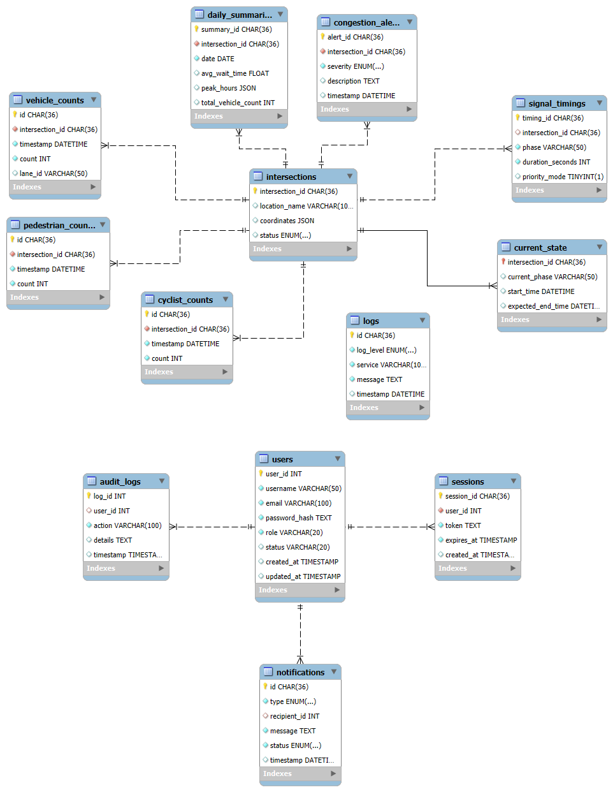

# Smart Traffic Lights System (STLS)

A microservices-based, containerized Smart Traffic Lights System that enhances urban mobility by dynamically managing traffic light signals based on real-time sensor input and analytics. This project aims to reduce congestion, prioritize emergency and public transport, and improve overall traffic efficiency.

## 🚦 Overview

The system is composed of three main layers:

### 1. Sensor Layer (Επίπεδο Αισθητήρων)
Responsible for collecting raw data from different sensor types at intersections:
- **Vehicle Sensors**: Detect vehicle count.
- **Emergency Vehicle Sensors**: Identify emergency vehicle presence.
- **Public Transport Sensors**: Detect buses/trams.
- **Pedestrian Sensors**: Detect pedestrian crossing requests.
- **Cyclist Sensors**: Detect cyclists.

Each sensor feeds its data to a corresponding Detection Service.

### 2. Traffic Layer (Επίπεδο Κυκλοφορίας)
Processes and analyzes sensor data, then applies logic to optimize traffic flow:
- **Detection Services** feed data to:
  - **Traffic Data Analytics Service**: Generates summaries and congestion alerts.
  - **Traffic Light Control Service**: Manages light cycles based on inputs.
- Databases used: `TrafficDataDb`, `TrafficLightDb`.

### 3. User Layer (Επίπεδο Χρήστη)
Interfaces for system operators and city authorities to monitor and receive updates:
- **Notification Service**: Sends alerts and notices.
- **Log Service**: Logs user activities, system events, and errors.
- **User Service**: Manages user info and access.
- Databases used: `NotificationDb`, `LogDb`, `UserDb`.

## 📊 Data Flow Summary

1. Sensors send real-time data to Detection Services.
2. Detection Services flag prioritization events (e.g. emergency vehicle detected).
3. Traffic Analytics Service processes data for trends and congestion.
4. Traffic Light Control Service adjusts signals dynamically.
5. User Layer issues notifications and logs events for audit/compliance.

---

## 🗺️ System Architecture Diagrams

### 🔧 Microservices Architecture  
  
[View full-size](diagrams/Microservices/Architecture.png)  

> Overview of the complete microservices ecosystem showing how Sensor, Traffic, and User layers interact via services and databases.

#### 🧠 Sensor Layer Diagram  
  
[View full-size](diagrams/Microservices/SensorLayer.png)  

> Shows how various real-time sensors (vehicles, pedestrians, cyclists, etc.) connect to detection services and pass data to the traffic control logic.

#### 🚦 Traffic Layer Diagram  
  
[View full-size](diagrams/Microservices/TrafficLayer.png)  

> Displays the analytical and control services responsible for processing traffic data and managing dynamic traffic light behavior.

#### 👥 User Layer Diagram  
  
[View full-size](diagrams/Microservices/UserLayer.png)  

> Highlights components that handle notifications, user interaction, activity logging, and system oversight.

---

### 🗄️ Database Schemas

- **Overall Database Schema**  
    
  [View full-size](diagrams/Databases/Schema.png)  

  > High-level view showing relationships among all system databases: User, Log, Notification, Traffic Data, and Traffic Light DBs. Useful for understanding how microservices interact with data stores.

- **User Database Schema**  
    
  [View full-size](diagrams/Databases/UserDb.png)  

  > Structure for storing user profiles, roles, access levels, and authentication details.

- **Log Database Schema**  
    
  [View full-size](diagrams/Databases/LogDb.png)  

  > Schema for system activity logging, including error tracking, audits, and operational logs.

- **Notification Database Schema**  
    
  [View full-size](diagrams/Databases/NotificationDb.png)  

  > Stores alert events, public notices, and internal system notifications for city authorities and operators.

- **Traffic Data Database Schema**  
    
  [View full-size](diagrams/Databases/TrafficDataDb.png)  

  > Schema for traffic statistics, historical flow data, and congestion metrics collected from intersections.

- **Traffic Light Database Schema**  
    
  [View full-size](diagrams/Databases/TrafficLightDb.png)  

  > Stores configuration and status of individual traffic lights, including priority flags and control history.

---

### ☁️ Cloud Architecture

#### 🧩 Cloud Deployment Diagram  
  
[View full-size](diagrams/Cloud/CloudArchitecture.png)  

> This diagram illustrates container orchestration using Docker & Kubernetes, distributed microservices deployment, message queues, and cloud databases.

---

### 📘 Use Case Diagram

#### 🎯 System Use Cases  
  
[View full-size](diagrams/UseCases/UseCases.png)  

> Describes the system’s main functional scenarios—like prioritizing emergency vehicles, logging operator actions, and controlling traffic lights—along with interactions by users and automated agents.

---

## Development Technologies

### Backend – .NET Core

- **.NET 9.0 (ASP.NET Core Web API)** – Development of REST and gRPC services
- **Entity Framework Core** – ORM for managing database access
- **MS SQL / MongoDB** – Support for both SQL and NoSQL storage
- **RabbitMQ** – Message broker for real-time, event-driven communication
- **JWT** – Authentication and authorization system

### Frontend – Vue.js

- **Vue.js 3 + Composition API** – Lightweight and scalable frontend framework
- **Vite** – Fast build system with hot module replacement
- **Pinia / Vuex** – State management for real-time UI updates
- **Vue Router** – Routing and navigation
- **gRPC-Web** – Communication with backend services over gRPC
- **Leaflet / Mapbox** – Traffic mapping and visualizations
- **Tailwind CSS** – Fast and responsive UI development

### Containers & Cloud Orchestration

- **Docker & Docker Compose** – Containerized development and testing environments
- **Kubernetes (K8s / K3s)** – Service orchestration, scaling, and high availability

---

## Development Environment

- **Visual Studio Code** – Lightweight editor for both frontend and backend
- **Postman** – API testing tool for REST and gRPC endpoints
- **Swagger** – API documentation and testing interface
- **Grafana / Prometheus** – System monitoring and observability

---