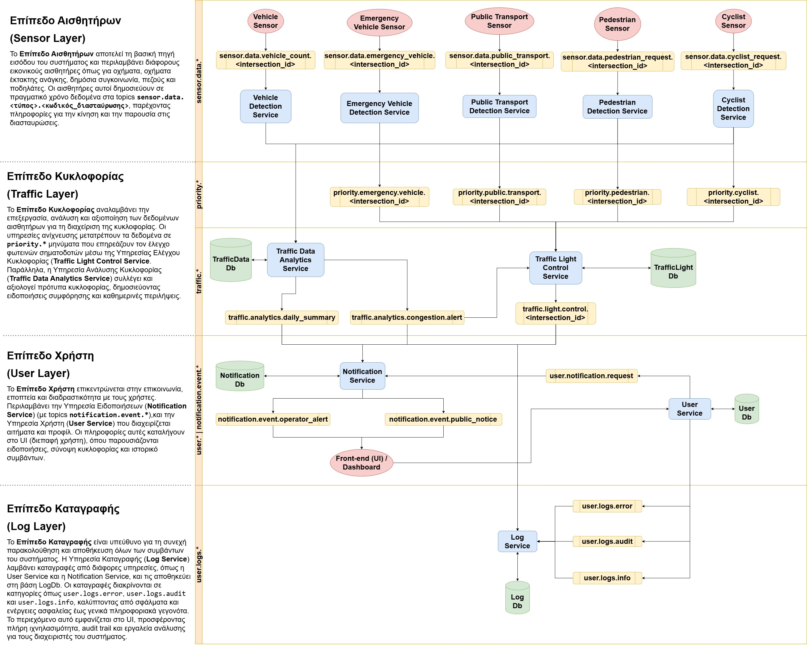
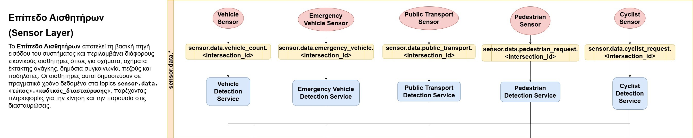
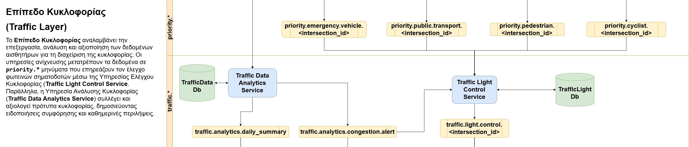
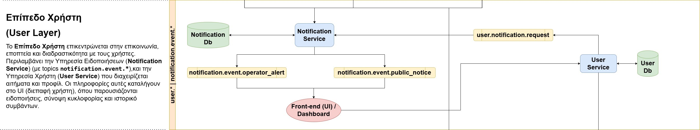
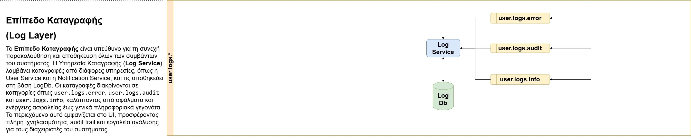

# Smart Traffic Lights System (STLS)

A microservices-based, containerized Smart Traffic Lights System that enhances urban mobility by dynamically managing traffic light signals based on real-time sensor input and analytics. This project aims to reduce congestion, prioritize emergency and public transport, and improve overall traffic efficiency.

## 🚦 Overview

STLS is organized into four distinct architectural layers:

### 1. Sensor Layer (Επίπεδο Αισθητήρων)

Captures raw real-time data from various sensors deployed at intersections:

- **Vehicle Sensors** – Detect number of vehicles.
- **Emergency Vehicle Sensors** – Identify presence of emergency responders.
- **Public Transport Sensors** – Detect buses, trams, and priority vehicles.
- **Pedestrian Sensors** – Register pedestrian crossing requests.
- **Cyclist Sensors** – Monitor cyclist presence.

Each sensor transmits data to a corresponding Detection Service, which triggers priority events (`priority.<type>.<intersection_id>`) to downstream services.

---

### 2. Traffic Layer (Επίπεδο Κυκλοφορίας)

Analyzes data and dynamically regulates traffic behavior:

- **Detection Services** forward data to:
  - **Traffic Data Analytics Service**
    - Emits daily summaries and congestion alerts.
    - Topics: `traffic.analytics.daily_summary`, `traffic.analytics.congestion.alert`
  - **Traffic Light Control Service**
    - Adjusts signal timings per intersection.
    - Topics: `traffic.light.control.<intersection_id>`
- Databases:
  - `TrafficDataDb`: Traffic stats & analytics.
  - `TrafficLightDb`: Traffic light configs and status.

---

### 3. User Layer (Επίπεδο Χρήστη)

Provides interaction and feedback mechanisms for city operators:

- **User Service**
  - Manages operator accounts and access.
  - Consumes `user.notification.request`.
- **Notification Service**
  - Sends targeted alerts (`notification.event.operator_alert`) and public notices (`notification.event.public_notice`).
- **Dashboard UI**
  - Front-end visualization and management interface.
- Databases:
  - `UserDb`: Operator credentials and metadata.
  - `NotificationDb`: Active alerts and public messages.

---

### 4. Log Layer (Επίπεδο Καταγραφής)

Tracks all system activity and ensures auditability:

- **Log Service**
  - Captures logs via:
    - `user.logs.error`
    - `user.logs.audit`
    - `user.logs.info`
- **LogDb** stores:
  - Errors, user actions, and event logs for compliance and troubleshooting.

---

## 📊 Data Flow Summary

1. Sensors send real-time data to Detection Services.
2. Detection Services flag prioritization events (e.g. emergency vehicle detected).
3. Traffic Analytics Service processes data for trends and congestion.
4. Traffic Light Control Service adjusts signals dynamically.
5. User Layer issues notifications and logs events for audit/compliance.

---

## 🗺️ System Architecture Diagrams

### 🔧 Microservices Architecture  
  
[View full-size](diagrams/Microservices/Architecture.jpg)  

> Overview of the complete microservices ecosystem showing how Sensor, Traffic, and User layers interact via services and databases.

#### 🧠 Sensor Layer Diagram  
  
[View full-size](diagrams/Microservices/SensorLayer.jpg)  

> Shows how various real-time sensors (vehicles, pedestrians, cyclists, etc.) connect to detection services and pass data to the traffic control logic.

#### 🚦 Traffic Layer Diagram  
  
[View full-size](diagrams/Microservices/TrafficLayer.jpg)  

> Displays the analytical and control services responsible for processing traffic data and managing dynamic traffic light behavior.

#### 👥 User Layer Diagram  
  
[View full-size](diagrams/Microservices/UserLayer.jpg)  

> Highlights components that handle notifications, user interaction, activity logging, and system oversight.

#### Log Layer Diagram

[View full-size](diagrams/Microservices/LogLayer.jpg)

> Depicts how the system logs critical information such as errors, user actions, and audit trails, ensuring observability, traceability, and operational compliance.

---

### 🗄️ Database Schemas

- **Overall Database Schema**  
    
  [View full-size](diagrams/Databases/Schema.png)  

  > High-level view showing relationships among all system databases: User, Log, Notification, Traffic Data, and Traffic Light DBs. Useful for understanding how microservices interact with data stores.

- **User Database Schema**  
    
  [View full-size](diagrams/Databases/UserDb.png)  

  > Structure for storing user profiles, roles, access levels, and authentication details.

- **Log Database Schema**  
    
  [View full-size](diagrams/Databases/LogDb.png)  

  > Schema for system activity logging, including error tracking, audits, and operational logs.

- **Notification Database Schema**  
    
  [View full-size](diagrams/Databases/NotificationDb.png)  

  > Stores alert events, public notices, and internal system notifications for city authorities and operators.

- **Traffic Data Database Schema**  
    
  [View full-size](diagrams/Databases/TrafficDataDb.png)  

  > Schema for traffic statistics, historical flow data, and congestion metrics collected from intersections.

- **Traffic Light Database Schema**  
    
  [View full-size](diagrams/Databases/TrafficLightDb.png)  

  > Stores configuration and status of individual traffic lights, including priority flags and control history.

---

### ☁️ Cloud Architecture

#### 🧩 Cloud Deployment Diagram  
  
[View full-size](diagrams/Cloud/CloudArchitecture.png)  

> This diagram illustrates container orchestration using Docker & Kubernetes, distributed microservices deployment, message queues, and cloud databases.

---

### 📘 Use Case Diagram

#### 🎯 System Use Cases  
  
[View full-size](diagrams/UseCases/UseCases.png)  

> Describes the system’s main functional scenarios—like prioritizing emergency vehicles, logging operator actions, and controlling traffic lights—along with interactions by users and automated agents.

---

## Development Technologies

### Backend – .NET Core

- **.NET 9.0 (ASP.NET Core Web API)** – Development of REST and gRPC services
- **Entity Framework Core** – ORM for managing database access
- **MS SQL / MongoDB** – Support for both SQL and NoSQL storage
- **RabbitMQ** – Message broker for real-time, event-driven communication
- **JWT** – Authentication and authorization system

### Frontend – Vue.js

- **Vue.js 3 + Composition API** – Lightweight and scalable frontend framework
- **Vite** – Fast build system with hot module replacement
- **Pinia / Vuex** – State management for real-time UI updates
- **Vue Router** – Routing and navigation
- **gRPC-Web** – Communication with backend services over gRPC
- **Leaflet / Mapbox** – Traffic mapping and visualizations
- **Tailwind CSS** – Fast and responsive UI development

### Containers & Cloud Orchestration

- **Docker & Docker Compose** – Containerized development and testing environments
- **Kubernetes (K8s / K3s)** – Service orchestration, scaling, and high availability

---

## Development Environment

- **Visual Studio Code** – Lightweight editor for both frontend and backend
- **Postman** – API testing tool for REST and gRPC endpoints
- **Swagger** – API documentation and testing interface
- **Grafana / Prometheus** – System monitoring and observability

---

## ▶️ How to Run the App

### 📦 Prerequisites

- Docker & Docker Compose
- Node.js (v18+)
- .NET 9.0 SDK
- RabbitMQ (containerized)
- (Optional) K3s or Minikube for Kubernetes

### 🐳 Local Docker Setup

Start all services:
```bash
./up.sh
```

Stop all services:
```bash
./down.sh
```

Start/stop specific layers:
```bash
./upUserLayer.sh
./downUserLayer.sh
```

Run frontend:
```bash
cd front-end
npm install
npm run dev
```

Frontend available at [http://localhost:5173](http://localhost:5173)

---

## 📁 Project Structure

```bash
SMART-TRAFFIC-LIGHTS-SYSTEM/
│
├── diagrams/                # Architecture and database diagrams
│   ├── Cloud/
│   ├── Databases/
│   ├── Microservices/
│   └── UseCases/
│
├── docs/                    # Layer documentation
│
├── src/
│   ├── back-end/
│   │   ├── LogLayer/
│   │   ├── RabbitMQ/
│   │   ├── SensorLayer/
│   │   ├── TrafficLayer/
│   │   └── UserLayer/
│   │       ├── NotificationService/
│   │       └── UserService/
│   │           ├── MSSQL/
│   │           └── UserAPI/
│   └── front-end/          # Vue.js dashboard
│
├── *.sh                    # Layer startup/shutdown scripts
│
└── README.md
```

---