# 🚦 Smart Traffic Lights System

## Overview

The **Smart Traffic Light System (STLS)** is a microservices-based platform designed to optimize urban traffic flow, prioritize emergency vehicles, manage public transport, and improve safety for pedestrians and cyclists. It uses **RabbitMQ** for asynchronous messaging and event-driven communication, **MS SQL** and **InfluxDB** for persistent and time-series data storage, respectively, and **Redis** for caching and fast data retrieval. The system leverages containerized services to ensure scalability, fault tolerance, and easy deployment.

---

## Layers & Services

### **1. Sensor Layer**
Simulates and collects traffic-related data from:
- Vehicles
- Emergency Vehicles
- Public Transport
- Pedestrians
- Cyclists
- Incident Reports

---

### **2. Traffic Layer**
- **Intersection Controller Service** – Processes incoming sensor data to decide priorities.
- **Traffic Light Control Service** – Updates lights according to instructions.
- **Traffic Light Coordination Service** – Synchronizes lights across intersections.
- **Traffic Data Analytics Service** – Detects congestion patterns and generates alerts.

---

### **3. User Layer**
- **Notification Service** – Sends alerts to operators and the public.
- **User Service** – Manages operator accounts, roles, and preferences.

---

### **4. Log Layer**
- **Log Service** – Centralized logging from all services for auditing and debugging.

---

## AMQP Overview and Data Flow Summary

### AMQP Overview

The Smart Traffic Lights System uses RabbitMQ as its messaging backbone to enable asynchronous communication between distributed services. Each service publishes and subscribes to specific AMQP topics (exchanges and queues) identified by structured routing keys, often including intersection IDs for scoped data.

- **Sensor Layer Services** publish real-time traffic and event data (e.g., vehicle counts, emergency vehicle detections, pedestrian crossing requests) on topics prefixed with `sensor.data.*`.
- **Traffic Layer Services** subscribe to sensor data topics to analyze traffic conditions and set priorities. They publish control commands and updates on topics such as `priority.*` and `traffic.light.*`.
- **User Layer Services** subscribe to analytics and notification topics to send alerts to operators and users.
- **Log Layer** centralizes all audit and error logs from every service using wildcard topics like `*.logs.*`, enabling centralized storage and monitoring.

The topic structure ensures decoupled communication where publishers and subscribers do not require direct knowledge of each other, allowing scalability and flexibility in the system.

---

### Data Flow Summary

#### 1. Sensor Layer: Data Collection and Publishing
- Vehicle Detection, Emergency Vehicle Detection, Public Transport Detection, Pedestrian and Cyclist Detection, and Incident Detection services collect real-time data using sensors.
- Each service publishes processed event data to intersection-specific AMQP topics such as:
  - `sensor.data.vehicle.count.<intersection_id>`
  - `sensor.data.emergency_vehicle.<intersection_id>`
  - `sensor.data.pedestrian.request.<intersection_id>`
- These messages represent the raw or pre-processed traffic events captured at each intersection.

#### 2. Traffic Layer: Data Aggregation and Control
- The Intersection Controller Service subscribes to sensor data topics for its intersection.
- It analyzes the incoming data to set priorities (e.g., emergency vehicles, public transport, pedestrians, cyclists) and publishes priority commands on topics like:
  - `priority.emergency.vehicle.<intersection_id>`
  - `priority.pedestrian.<intersection_id>`
- Traffic Light Control Service listens for control commands (`traffic.light.control.<intersection_id>`) and updates the state of individual traffic lights.
- Traffic Light Coordination Service synchronizes light timings across intersections by listening to priority topics and publishing coordinated light updates.
- Traffic Data Analytics Service performs data analytics by subscribing to sensor data topics, detecting congestion or incidents, and publishing alerts on topics such as:
  - `traffic.analytics.congestion.alert`
  - `traffic.analytics.daily.summary`

#### 3. User Layer: Notifications and Interaction
- Notification Service subscribes to analytics alerts and user notification requests, distributing messages to operators or the public via:
  - `notification.event.public_notice`
  - `notification.event.operator_alert`
- User Service manages user accounts and triggers notifications by publishing to `user.notification.request`.

#### 4. Log Layer: Centralized Logging
- All services publish audit and error logs to dedicated topics (e.g., `sensor.logs.audit`, `traffic.logs.error`).
- Log Service subscribes to all logs using wildcard topics like `*.logs.*` for centralized collection and storage.

---

This AMQP topic-driven design enables modular, scalable, and reliable communication between all layers of the traffic management system.

---

## Use Cases

### A. Traffic Management (Automatic)

1. **Adjust traffic lights based on vehicle flow**  
   - Sensor Layer detects vehicle count and sends it to Intersection Controller.  
   - Controller sets light durations accordingly.  

2. **Prioritize emergency vehicles**  
   - Emergency Vehicle Detection triggers priority mode at intersection.  

3. **Prioritize public transport**  
   - Bus/tram detection extends green light for transit lanes.  

4. **Handle pedestrian and cyclist crossings**  
   - When detected, the light cycle adjusts to allow safe passage.  

5. **Incident response**  
   - Accident or hazard detection changes light cycles to reroute traffic.  

---

### B. Analytics & Monitoring

6. **Real-time traffic status monitoring**  
   - Traffic Light Control & Coordination services expose current light state.  

7. **Congestion alerts**  
   - Analytics service sends alert if congestion threshold is exceeded.  

8. **Daily traffic summaries**  
   - Analytics generates daily/weekly reports for operators.  

---

### C. User Interaction

9. **Operator manual override**  
   - Authorized operators can manually set light states or timing.  

10. **Public notifications**  
    - Push alerts for delays, road closures, incidents.  

11. **User management**  
    - Create, update, and authenticate operator accounts.  

---

### D. System Management

12. **Logging and auditing**  
    - All actions/events stored in centralized log.  

13. **Service health checks**  
    - Endpoints to monitor microservice status.  


## System Architecture Diagrams

The following diagrams illustrate the layered architecture of the Smart Traffic Lights System (STLS), showing how microservices interact within Sensor, Traffic, User, and Log domains. The system relies on RabbitMQ messaging to enable real-time event-driven communication between services.

### Microservices Architecture  
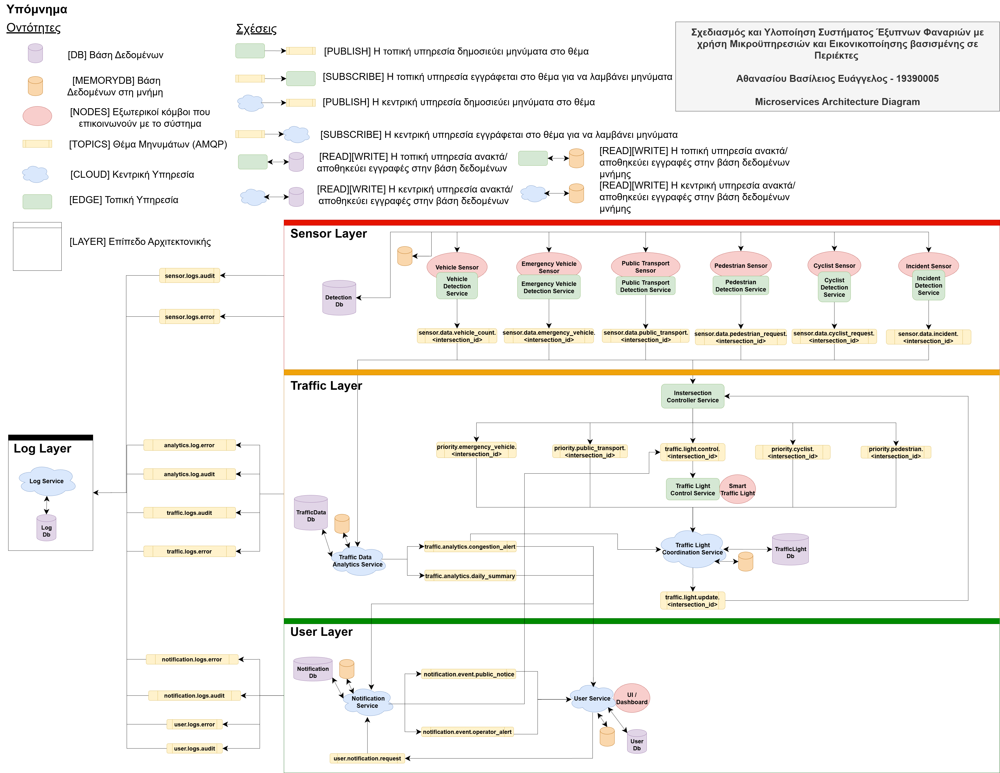  
[View full-size](diagrams/Microservices/Architecture.png)  

> Overview of the complete microservices ecosystem showing how **Sensor**, **Traffic**, **User**, and **Log** layers interact via services and databases.

#### Sensor Layer Diagram  
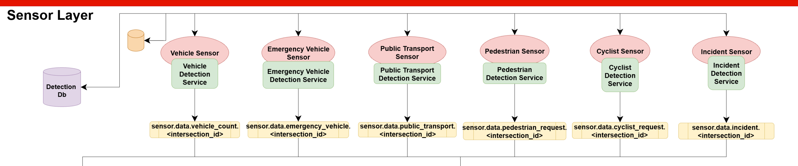  
[View full-size](diagrams/Microservices/SensorLayer.png)  

> Shows how various real-time sensors (vehicles, pedestrians, cyclists, etc.) connect to detection services and pass data to the traffic control logic.

#### Traffic Layer Diagram  
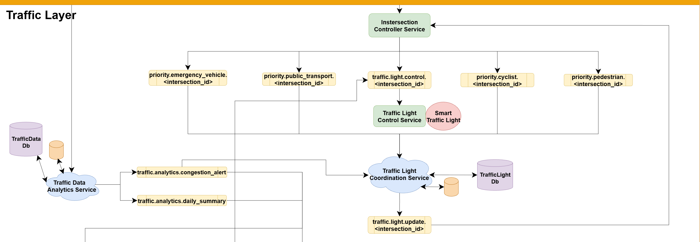  
[View full-size](diagrams/Microservices/TrafficLayer.png)  

> Displays the analytical and control services responsible for processing traffic data and managing dynamic traffic light behavior.

#### User Layer Diagram  
  
[View full-size](diagrams/Microservices/UserLayer.png)  

> Highlights components that handle notifications, user interaction, activity logging, and system oversight.

#### Log Layer Diagram  
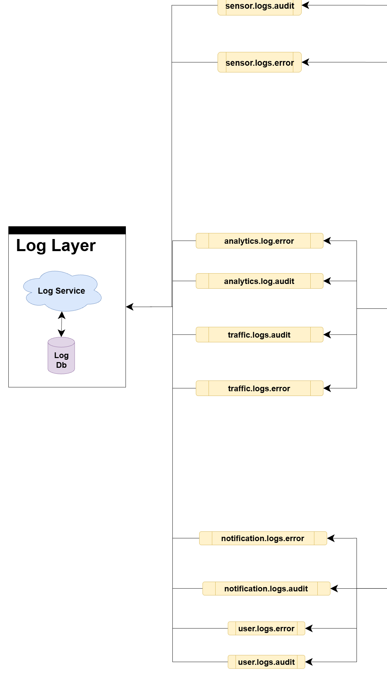  
[View full-size](diagrams/Microservices/LogLayer.png)  

> Depicts how the system logs critical information such as errors, user actions, and audit trails, ensuring observability, traceability, and operational compliance.

---

### Database Schemas

#### Overall Database Schema  
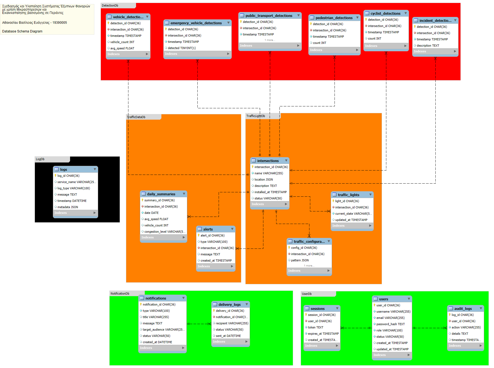  
[View full-size](diagrams/Databases/DbSchema.png)  

> High-level view showing relationships among all system databases: User, Log, Notification, Traffic Data, Traffic Light, and Detection DBs. Useful for understanding how microservices interact with data stores.

#### Detection Database Schema  
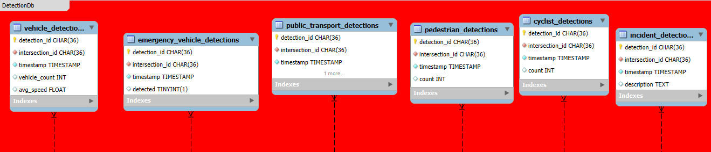  
[View full-size](diagrams/Databases/DetectionDb.png)  

> Contains raw and processed sensor data from vehicles, emergency vehicles, public transport, pedestrians, cyclists, and incidents to support real-time traffic monitoring and control.

#### Traffic Data Database Schema  
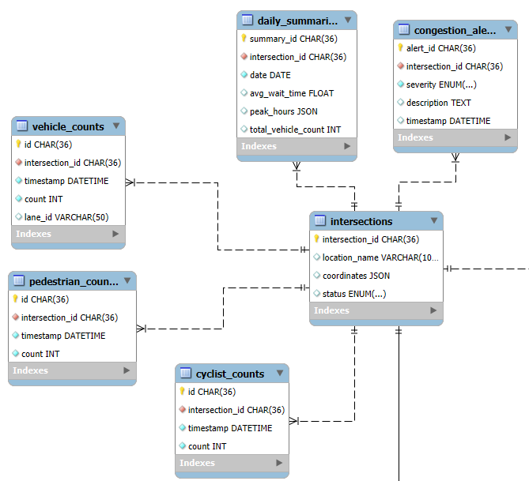  
[View full-size](diagrams/Databases/TrafficDataDb.png)  

> Schema for traffic statistics, historical flow data, and congestion metrics collected from intersections.

#### Traffic Light Database Schema  
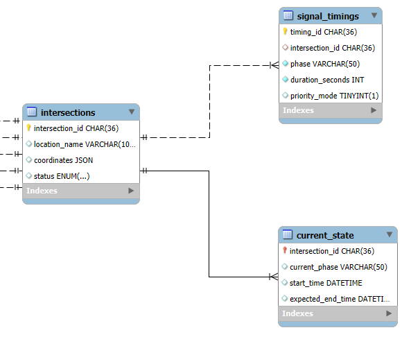  
[View full-size](diagrams/Databases/TrafficLightDb.png)  

> Stores configuration and status of individual traffic lights, including priority flags and control history.

#### User Database Schema  
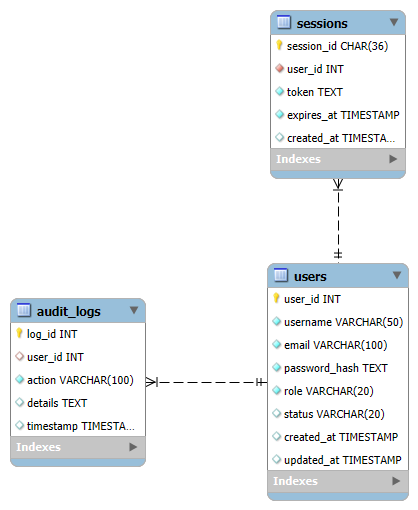  
[View full-size](diagrams/Databases/UserDb.png)  

> Structure for storing user profiles, roles, access levels, and authentication details.

#### Notification Database Schema   
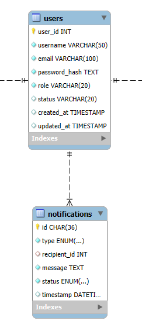  
[View full-size](diagrams/Databases/NotificationDb.png)  

> Stores alert events, public notices, and internal system notifications for city authorities and operators.

#### Log Database Schema  
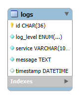  
[View full-size](diagrams/Databases/LogDb.png)  

> Schema for system activity logging, including error tracking, audits, and operational logs.

---

### Use Case Diagram

#### System Use Cases (Overall)  
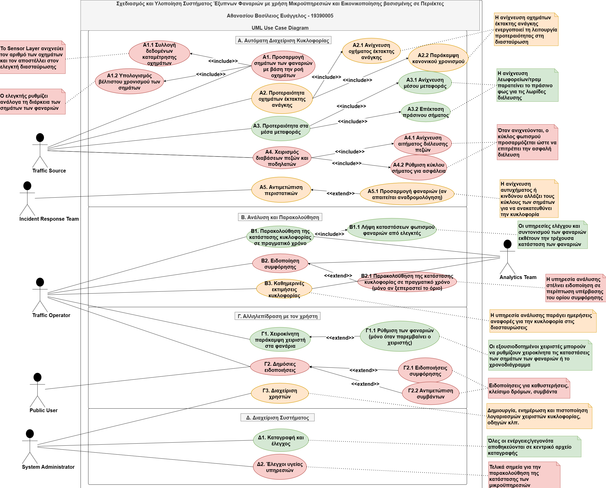  
[View full-size](diagrams/UML/UseCases.png)  

> This diagram captures the primary functional scenarios of the Smart Traffic Management System, grouped into four main domains: **Traffic Management (Automatic)**, **Analytics & Monitoring**, **User Interaction**, and **System Management**.

---

## Use Cases

### A. Traffic Management (Automatic)

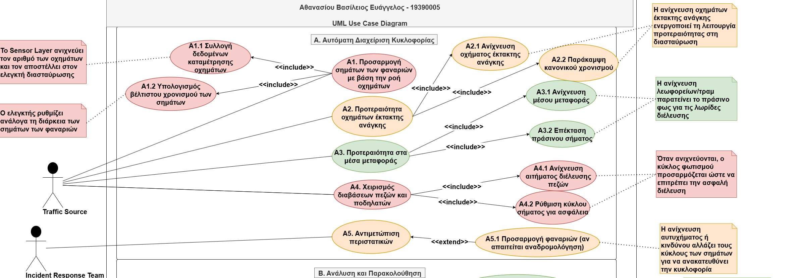  
[View full-size](diagrams/UML/AutomaticTrafficManagement.png)  

> Automated control of traffic lights, prioritization of emergency and public transport vehicles, pedestrian and cyclist safety, and incident-based traffic adjustments.

---

### B. Analytics & Monitoring

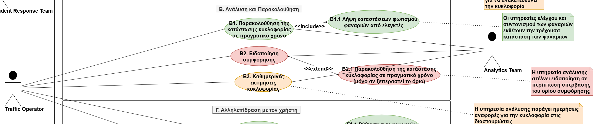  
[View full-size](diagrams/UML/AnalyticsAndMonitoring.png)  

> Real-time monitoring of traffic conditions, congestion detection, and generation of analytical reports for operators.

---

### C. User Interaction

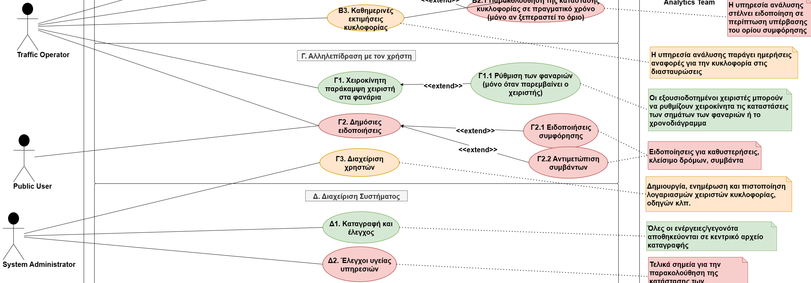  
[View full-size](diagrams/UML/UserInteraction.png)  

> Interfaces for operators to manually control traffic lights, send public notifications, and manage user accounts.

---

### D. System Management

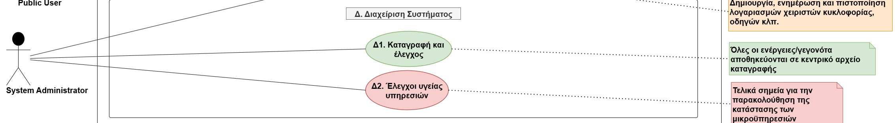  
[View full-size](diagrams/UML/SystemManagement.png)  

> Logging of all actions/events and monitoring of microservice health to ensure operational reliability.

---

### Kubernetes Deployment Architecture

#### Kubernetes Deployment Diagram  
  
[View full-size](diagrams/Deployment/Kubernetes.png)  

> This diagram illustrates container orchestration using Docker & Kubernetes, distributed microservices deployment, message queues, and cloud databases.

---

## Development Technologies

### Backend – .NET Core

- **.NET 9.0 (ASP.NET Core Web API)** – REST and gRPC services
- **Entity Framework Core** – ORM for relational databases (MSSQL)
- **MassTransit** – Distributed message bus integration with RabbitMQ
- **AutoMapper** – Object-to-object mapping between DTOs and entities
- **JWT** – Authentication and authorization
- **MS SQL / MongoDB / InfluxDB / Redis** – Multiple database types for different workloads

### Frontend – Vue.js

- **Vue.js 3 + Composition API** – Modern reactive frontend framework
- **Vite** – Fast build tool with hot module replacement
- **Pinia** – State management
- **Vue Router** – Routing and navigation
- **Axios** – HTTP client for REST calls
- **gRPC-Web** – Communication with backend gRPC endpoints
- **Leaflet** or **Mapbox GL JS** – Interactive maps
- **Chart.js** or **Apache ECharts** – Graphs and traffic statistics visualizations
- **Tailwind CSS** – Utility-first responsive UI design
- **VueUse** – Common composition utilities

### Containers & Orchestration

- **Docker & Docker Compose** – Containerized dev/test environments
- **Minikube** – Local Kubernetes cluster for development
- **Kubernetes (K8s)** – Service orchestration, scaling, and availability
- **Helm** – Package management for Kubernetes

---

## Development Environment

- **OS:** Debian VM on VirtualBox  
- **IDE:** Visual Studio Code  
- **Database Tools:** Azure Data Studio for relational DBs (MS SQL), **Chronograf** or **InfluxDB UI** for time-series DBs, and **RedisInsight** for Redis cache monitoring  
- **API Testing:** Postman  
- **API Documentation:** Swagger  
- **Monitoring:** Grafana / Prometheus  

---

## How to Run the App

### Prerequisites

- Docker & Docker Compose  
- Node.js (v18+)  
- .NET 9.0 SDK  
- K3s or Minikube for Kubernetes  
- Linux: Ubuntu 20.04 / Debian 11 (recommended for development VM or host OS)

### Clone Repository and Navigate

Clone the project repository:

```bash
git clone https://github.com/Ath21/Smart-Traffic-Lights-System.git
```

Navigate to backend:

```bash
cd Smart-Traffic-Lights-System/src/back-end
# Here you will find the up.sh and down.sh scripts
```

### Command Tools

Start all services (default starts all layers & RabbitMQ):
```bash
./up.sh --all
```

Stop all services:
```bash
./down.sh --all
```

Start/stop specific layers:
```bash
./up.sh --user
./down.sh --user

./up.sh --log
./down.sh --log

./up.sh --traffic
./down.sh --traffic

./up.sh --sensor
./down.sh --sensor
```

Start/stop specific service inside a layer:
```bash
./up.sh --service=ServiceName
./down.sh --service=ServiceName
```

Start/stop RabbitMQ only:
```bash
./up.sh --rabbitmq
./down.sh --rabbitmq
```

Run services in different modes:
```bash
./up.sh --mode=local
./down.sh --mode=local

./up.sh --mode=docker
./down.sh --mode=docker

./up.sh --mode=k8s
./down.sh --mode=k8s
```

Show help message:
```bash
./up.sh --help
./down.sh --help
```

---

## Project Structure

```bash
SMART-TRAFFIC-LIGHTS-SYSTEM/
│
├── diagrams/                # Architecture and database diagrams
│   ├── Deployment/
│   ├── Databases/
│   ├── Microservices/
│   └── UML/
│
├── docs/                    # Layer documentation
│
├── src/
│   ├── back-end/
│   │   ├── LogLayer/
│   │   ├── RabbitMQ/
│   │   ├── SensorLayer/
│   │   ├── TrafficLayer/
│   │   └── UserLayer/
│   │       ├── NotificationService/
│   │       └── UserService/
│   │           ├── MSSQL/
│   │           └── UserAPI/
│   └── front-end/          # Vue.js dashboard
│
├── *.sh                    # Layer startup/shutdown scripts
│
└── README.md
```

---