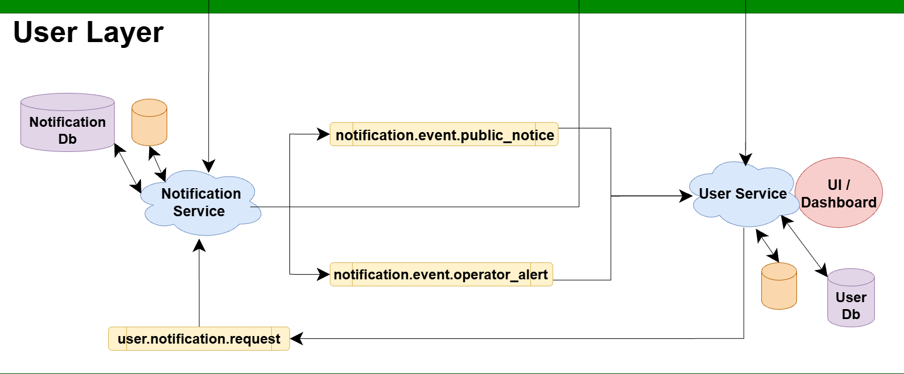
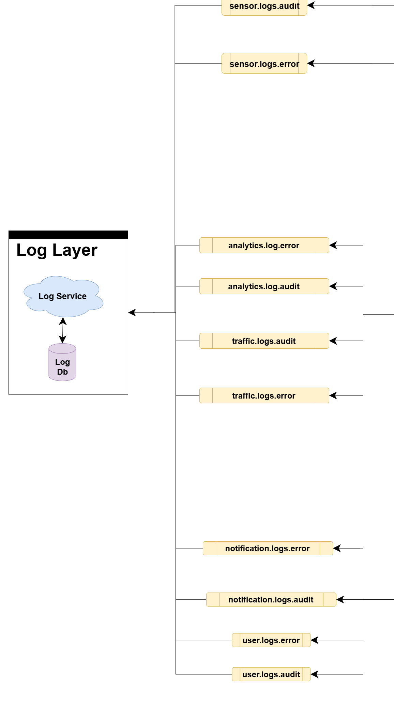
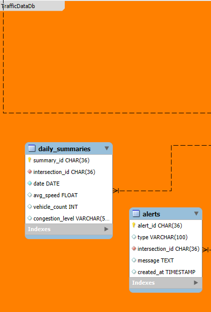
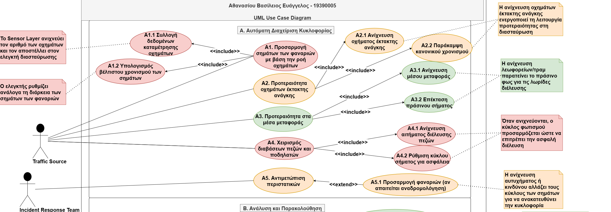
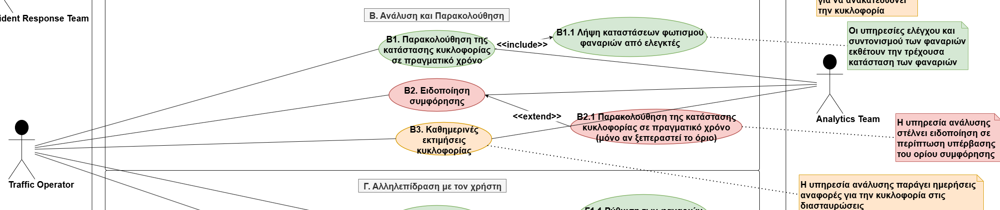
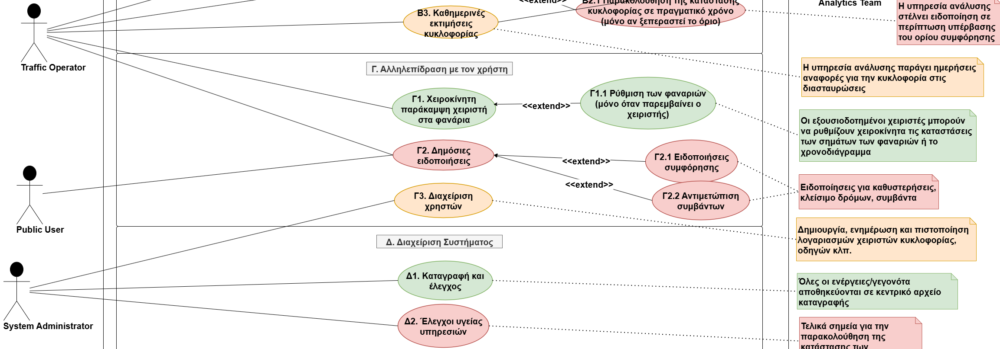
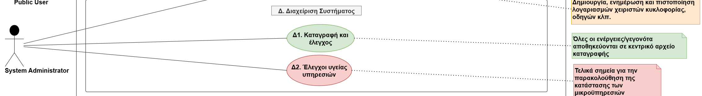

# 🚦 Σύστημα Έξυπνων Φαναριών

## Επισκόπηση

Το **Σύστημα Έξυπνων Φαναριών (STLS)** είναι μια πλατφόρμα βασισμένη σε μικροϋπηρεσίες που σχεδιάστηκε για τη βελτιστοποίηση της ροής της αστικής κυκλοφορίας, την προτεραιοποίηση οχημάτων έκτακτης ανάγκης, τη διαχείριση δημόσιων μέσων μεταφοράς και τη βελτίωση της ασφάλειας πεζών και ποδηλατών. Χρησιμοποιεί **RabbitMQ** για ασύγχρονη ανταλλαγή μηνυμάτων και επικοινωνία βάσει γεγονότων, **MS SQL** και **InfluxDB** για μόνιμη και χρονική αποθήκευση δεδομένων, αντίστοιχα, και **Redis** για caching και γρήγορη ανάκτηση δεδομένων. Το σύστημα αξιοποιεί υπηρεσίες σε περιέκτες για να εξασφαλίσει επεκτασιμότητα, ανθεκτικότητα σε σφάλματα και εύκολη ανάπτυξη.

---

## Επίπεδα & Υπηρεσίες

### **1. Επίπεδο Αισθητήρων**
Προσομοιώνει και συλλέγει δεδομένα σχετιζόμενα με την κυκλοφορία από:
- Οχήματα
- Όχηματα έκτακτης ανάγκης
- Δημόσια μέσα μεταφοράς
- Πεζούς
- Ποδηλάτες
- Αναφορές συμβάντων

---

### **2. Επίπεδο Κυκλοφορίας**
- **Υπηρεσία Ελέγχου Διασταυρώσεων** – Επεξεργάζεται τα εισερχόμενα δεδομένα αισθητήρων για τον καθορισμό προτεραιοτήτων.
- **Υπηρεσία Ελέγχου Φαναριών** – Ενημερώνει τα φανάρια σύμφωνα με τις εντολές.
- **Υπηρεσία Συντονισμού Φαναριών** – Συγχρονίζει τα φανάρια σε διασταυρώσεις.
- **Υπηρεσία Ανάλυσης Δεδομένων Κυκλοφορίας** – Ανιχνεύει μοτίβα συμφόρησης και δημιουργεί ειδοποιήσεις.

---

### **3. Επίπεδο Χρηστών**
- **Υπηρεσία Ειδοποιήσεων** – Στέλνει ειδοποιήσεις σε χειριστές και κοινό.
- **Υπηρεσία Χρηστών** – Διαχειρίζεται λογαριασμούς χειριστών, ρόλους και προτιμήσεις.

---

### **4. Επίπεδο Καταγραφών**
- **Υπηρεσία Καταγραφής** – Κεντρική καταγραφή από όλες τις υπηρεσίες για έλεγχο και αποσφαλμάτωση.

---

## Επισκόπηση AMQP και Συνοπτική Ροή Δεδομένων

### Επισκόπηση AMQP

Το Σύστημα Έξυπνων Φαναριών χρησιμοποιεί το RabbitMQ ως τη ραχοκοκαλιά ανταλλαγής μηνυμάτων για να επιτρέψει ασύγχρονη επικοινωνία μεταξύ διανεμημένων υπηρεσιών. Κάθε υπηρεσία δημοσιεύει και εγγράφεται σε συγκεκριμένα θέματα AMQP (exchanges και queues) που αναγνωρίζονται από δομημένα routing keys, συχνά περιλαμβάνοντας τα IDs διασταυρώσεων για περιορισμένη εμβέλεια.

- Οι υπηρεσίες του Επίπεδου Αισθητήρων δημοσιεύουν σε πραγματικό χρόνο δεδομένα κυκλοφορίας και γεγονότα (π.χ. καταμέτρηση οχημάτων, ανίχνευση οχημάτων έκτακτης ανάγκης, αιτήματα πεζών) σε θέματα με πρόθεμα `sensor.data.*`.
- Οι υπηρεσίες του Επίπεδου Κυκλοφορίας εγγράφονται στα θέματα δεδομένων αισθητήρων για να αναλύσουν την κυκλοφορία και να ορίσουν προτεραιότητες. Δημοσιεύουν εντολές ελέγχου και ενημερώσεις σε θέματα όπως `priority.*` και `traffic.light.*`.
- Οι υπηρεσίες του Επίπεδου Χρηστών εγγράφονται σε θέματα ανάλυσης και ειδοποιήσεων για να στείλουν ειδοποιήσεις σε χειριστές και χρήστες.
- Το Επίπεδο Καταγραφών κεντροποιεί όλα τα audit και error logs από κάθε υπηρεσία χρησιμοποιώντας wildcard θέματα όπως `*.logs.*`, επιτρέποντας κεντρική αποθήκευση και παρακολούθηση.

Η δομή θεμάτων επιτρέπει αποσυνδεδεμένη επικοινωνία όπου οι εκδότες και οι συνδρομητές δεν χρειάζεται να γνωρίζουν άμεσα ο ένας τον άλλο, επιτρέποντας επεκτασιμότητα και ευελιξία στο σύστημα.

---

### Συνοπτική Ροή Δεδομένων

#### 1. Επίπεδο Αισθητήρων: Συλλογή και Δημοσίευση Δεδομένων
- Οι υπηρεσίες ανίχνευσης οχημάτων, οχημάτων έκτακτης ανάγκης, δημόσιων μέσων, πεζών, ποδηλατών και συμβάντων συλλέγουν δεδομένα σε πραγματικό χρόνο.
- Κάθε υπηρεσία δημοσιεύει επεξεργασμένα δεδομένα γεγονότων σε θεματικά θέματα ανά διασταύρωση, όπως:
  - `sensor.data.vehicle.count.<intersection_id>`
  - `sensor.data.emergency_vehicle.<intersection_id>`
  - `sensor.data.pedestrian.request.<intersection_id>`
- Αυτά τα μηνύματα αντιπροσωπεύουν τα ακατέργαστα ή προεπεξεργασμένα γεγονότα κυκλοφορίας που καταγράφονται σε κάθε διασταύρωση.

#### 2. Επίπεδο Κυκλοφορίας: Συγκέντρωση και Έλεγχος
- Η Υπηρεσία Ελέγχου Διασταυρώσεων εγγράφεται σε θέματα δεδομένων αισθητήρων για την αντίστοιχη διασταύρωση.
- Αναλύει τα εισερχόμενα δεδομένα για να θέσει προτεραιότητες (π.χ. οχήματα έκτακτης ανάγκης, δημόσια μέσα, πεζούς, ποδηλάτες) και δημοσιεύει εντολές προτεραιότητας σε θέματα όπως:
  - `priority.emergency.vehicle.<intersection_id>`
  - `priority.pedestrian.<intersection_id>`
- Η Υπηρεσία Ελέγχου Φαναριών ακούει εντολές ελέγχου (`traffic.light.control.<intersection_id>`) και ενημερώνει την κατάσταση των φαναριών.
- Η Υπηρεσία Συντονισμού Φαναριών συγχρονίζει τα χρονικά διαστήματα φαναριών σε διασταυρώσεις ακούγοντας θέματα προτεραιοτήτων και δημοσιεύοντας συντονισμένες ενημερώσεις.
- Η Υπηρεσία Ανάλυσης Δεδομένων Κυκλοφορίας αναλύει δεδομένα, ανιχνεύει συμφόρηση ή συμβάντα, και στέλνει ειδοποιήσεις σε θέματα όπως:
  - `traffic.analytics.congestion.alert`
  - `traffic.analytics.daily.summary`

#### 3. Επίπεδο Χρηστών: Ειδοποιήσεις και Αλληλεπίδραση
- Η Υπηρεσία Ειδοποιήσεων εγγράφεται σε ειδοποιήσεις αναλύσεων και αιτήματα ειδοποιήσεων χρηστών, διανέμοντας μηνύματα σε χειριστές ή κοινό μέσω:
  - `notification.event.public_notice`
  - `notification.event.operator_alert`
- Η Υπηρεσία Χρηστών διαχειρίζεται λογαριασμούς και ενεργοποιεί ειδοποιήσεις δημοσιεύοντας σε  
  - `user.notification.request`.

#### 4. Επίπεδο Καταγραφών: Κεντρική Καταγραφή
- Όλες οι υπηρεσίες δημοσιεύουν audit και error logs σε ειδικά θέματα (π.χ. `sensor.logs.audit`, `traffic.logs.error`).
- Η Υπηρεσία Καταγραφής εγγράφεται σε όλα τα logs με wildcard θέματα `*.logs.*` για κεντρική συλλογή και αποθήκευση.

---

Αυτή η σχεδίαση με θέματα AMQP επιτρέπει μια αρθρωτή, επεκτάσιμη και αξιόπιστη επικοινωνία μεταξύ όλων των επιπέδων του συστήματος διαχείρισης κυκλοφορίας.

---

## Περιπτώσεις Χρήσης

### Α. Διαχείριση Κυκλοφορίας (Αυτόματη)

1. **Ρύθμιση φαναριών βάσει ροής οχημάτων**  
   - Το Επίπεδο Αισθητήρων ανιχνεύει καταμέτρηση οχημάτων και την στέλνει στον Ελεγκτή Διασταύρωσης.  
   - Ο Ελεγκτής ρυθμίζει τη διάρκεια των φαναριών ανάλογα.

2. **Προτεραιοποίηση οχημάτων έκτακτης ανάγκης**  
   - Η ανίχνευση οχημάτων έκτακτης ανάγκης ενεργοποιεί προτεραιότητα στη διασταύρωση.

3. **Προτεραιοποίηση δημόσιων μέσων**  
   - Η ανίχνευση λεωφορείων/τραμ επεκτείνει το πράσινο φως για τις λωρίδες μεταφοράς.

4. **Διαχείριση πεζών και ποδηλατών**  
   - Όταν ανιχνεύονται, ο κύκλος φαναριών προσαρμόζεται για ασφαλή διέλευση.

5. **Αντιμετώπιση συμβάντων**  
   - Η ανίχνευση ατυχημάτων ή κινδύνων αλλάζει τον κύκλο φαναριών για εκτροπή κυκλοφορίας.

---

### Β. Ανάλυση & Παρακολούθηση

6. **Παρακολούθηση κατάστασης κυκλοφορίας σε πραγματικό χρόνο**  
   - Οι Υπηρεσίες Ελέγχου & Συντονισμού Φαναριών εκθέτουν την τρέχουσα κατάσταση των φαναριών.

7. **Ειδοποιήσεις συμφόρησης**  
   - Η Υπηρεσία Ανάλυσης στέλνει ειδοποίηση όταν ξεπεραστεί το όριο συμφόρησης.

8. **Καθημερινές αναφορές κυκλοφορίας**  
   - Η ανάλυση δημιουργεί ημερήσιες/εβδομαδιαίες αναφορές για τους χειριστές.

---

### Γ. Αλληλεπίδραση Χρηστών

9. **Χειροκίνητη παράκαμψη χειριστών**  
   - Εξουσιοδοτημένοι χειριστές μπορούν να ρυθμίζουν χειροκίνητα κατάσταση ή χρονισμό φαναριών.

10. **Δημόσιες ειδοποιήσεις**  
    - Αποστολή ειδοποιήσεων για καθυστερήσεις, κλεισίματα δρόμων, συμβάντα.

11. **Διαχείριση χρηστών**  
    - Δημιουργία, ενημέρωση και πιστοποίηση λογαριασμών χειριστών.

---

### Δ. Διαχείριση Συστήματος

12. **Καταγραφή και έλεγχος**  
    - Όλες οι ενέργειες/γεγονότα αποθηκεύονται σε κεντρικό αρχείο καταγραφής.

13. **Έλεγχοι υγείας υπηρεσιών**  
    - Τερματικά για παρακολούθηση κατάστασης μικροϋπηρεσιών.

---

## Αρχιτεκτονικά Διαγράμματα Συστήματος

Τα παρακάτω διαγράμματα απεικονίζουν την πολυεπίπεδη αρχιτεκτονική του Συστήματος Έξυπνων Φαναριών (STLS), δείχνοντας πώς οι μικροϋπηρεσίες αλληλεπιδρούν μέσα στους τομείς Αισθητήρων, Κυκλοφορίας, Χρηστών και Καταγραφών.
Το σύστημα βασίζεται στο RabbitMQ για την υλοποίηση πραγματικού χρόνου επικοινωνίας βασισμένης σε γεγονότα (event-driven).

### Αρχιτεκτονική Μικροϋπηρεσιών 
  
[Προβολή πλήρους μεγέθους](diagrams/Microservices/Architecture.png)  

> Επισκόπηση του πλήρους οικοσυστήματος μικροϋπηρεσιών που δείχνει πώς τα επίπεδα **Αισθητήρων**, **Κυκλοφορίας**, **Χρηστών** και **Καταγραφών** αλληλεπιδρούν μέσω υπηρεσιών και βάσεων δεδομένων.

#### Διάγραμμα Επιπέδου Αισθητήρων  
  
[Προβολή πλήρους μεγέθους](diagrams/Microservices/SensorLayer.png)  

> Δείχνει πώς διάφοροι αισθητήρες πραγματικού χρόνου (οχήματα, πεζοί, ποδηλάτες κ.λπ.) συνδέονται με υπηρεσίες ανίχνευσης και προωθούν δεδομένα στη λογική ελέγχου κυκλοφορίας.

#### Διάγραμμα Επιπέδου Κυκλοφορίας  
  
[Προβολή πλήρους μεγέθους](diagrams/Microservices/TrafficLayer.png)  

> Απεικονίζει τις αναλυτικές και ελεγκτικές υπηρεσίες που επεξεργάζονται δεδομένα κυκλοφορίας και διαχειρίζονται τη δυναμική λειτουργία των φαναριών

#### Διάγραμμα Επιπέδου Χρηστών  
  
[Προβολή πλήρους μεγέθους](diagrams/Microservices/UserLayer.png)  

> Τονίζει τα συστατικά που χειρίζονται ειδοποιήσεις, αλληλεπίδραση με χρήστες, καταγραφή δραστηριοτήτων και επίβλεψη συστήματος.

#### Διάγραμμα Επιπέδου Καταγραφών  
  
[Προβολή πλήρους μεγέθους](diagrams/Microservices/LogLayer.png)  

> Δείχνει πώς το σύστημα καταγράφει κρίσιμες πληροφορίες όπως σφάλματα, ενέργειες χρηστών και αρχεία ελέγχου, διασφαλίζοντας την παρατηρησιμότητα, ιχνηλασιμότητα και λειτουργική συμμόρφωση.

---

### Σχήματα Βάσεων Δεδομένων

#### Γενικό Σχήμα Βάσεων Δεδομένων 
  
[Προβολή πλήρους μεγέθους](diagrams/Databases/DbSchema.png)  

> Επισκόπηση υψηλού επιπέδου που δείχνει τις σχέσεις μεταξύ όλων των βάσεων του συστήματος: Χρήστη, Καταγραφών, Ειδοποιήσεων, Δεδομένων Κυκλοφορίας, Φαναριών και Ανίχνευσης.

#### Σχήμα Βάσης Ανίχνευσης  
  
[Προβολή πλήρους μεγέθους](diagrams/Databases/DetectionDb.png)  

> Περιέχει ακατέργαστα και επεξεργασμένα δεδομένα αισθητήρων από οχήματα, οχήματα έκτακτης ανάγκης, δημόσια συγκοινωνία, πεζούς, ποδηλάτες και συμβάντα.

#### Σχήμα Βάσης Δεδομένων Κυκλοφορίας  
  
[Προβολή πλήρους μεγέθους](diagrams/Databases/TrafficDataDb.png)  

> Σχήμα για στατιστικά κυκλοφορίας, ιστορικά δεδομένα ροής και μετρήσεις συμφόρησης.

#### Σχήμα Βάσης Δεδομένων Φαναριών  
  
[Προβολή πλήρους μεγέθους](diagrams/Databases/TrafficLightDb.png)  

> Αποθηκεύει ρυθμίσεις και κατάσταση κάθε φαναριού, συμπεριλαμβανομένων σημαιών προτεραιότητας και ιστορικού ελέγχου.

#### Σχήμα Βάσης Δεδομένων Χρηστών  
  
[Προβολή πλήρους μεγέθους](diagrams/Databases/UserDb.png)  

> Δομή για αποθήκευση προφίλ χρηστών, ρόλων, επιπέδων πρόσβασης και στοιχείων ταυτοποίησης.

#### Σχήμα Βάσης Ειδοποιήσεων   
  
[Προβολή πλήρους μεγέθους](diagrams/Databases/NotificationDb.png)  

> Αποθηκεύει συμβάντα ειδοποιήσεων, δημόσιες ανακοινώσεις και εσωτερικές ειδοποιήσεις συστήματος.

#### Σχήμα Βάσης Καταγραφών  
  
[Προβολή πλήρους μεγέθους](diagrams/Databases/LogDb.png)  

> Σχήμα για καταγραφή δραστηριοτήτων συστήματος, συμπεριλαμβανομένης παρακολούθησης σφαλμάτων, ελέγχων και λειτουργικών αρχείων.

---

### Διάγραμμα Περιπτώσεων Χρήσης

#### Συνολικές Περιπτώσεις Χρήσης Συστήματος  
  
[Προβολή πλήρους μεγέθους](diagrams/UML/UseCases.png)  

> Το διάγραμμα αυτό αποτυπώνει τα κύρια λειτουργικά σενάρια του Συστήματος Έξυπνης Διαχείρισης Κυκλοφορίας, ομαδοποιημένα σε τέσσερις βασικούς τομείς: **Αυτόματη Διαχείριση Κυκλοφορίας**, **Αναλυτικά Στοιχεία & Παρακολούθηση**, **Αλληλεπίδραση Χρήστη** και **Διαχείριση Συστήματος**.

---

## Περιπτώσεις Χρήσης

### Α. Αυτόματη Διαχείριση Κυκλοφορίας 

  
[Προβολή πλήρους μεγέθους](diagrams/UML/AutomaticTrafficManagement.png)  

> Αυτοματοποιημένος έλεγχος φαναριών, προτεραιοποίηση οχημάτων έκτακτης ανάγκης και δημόσιας συγκοινωνίας, ασφάλεια πεζών και ποδηλατών, καθώς και προσαρμογές κυκλοφορίας με βάση περιστατικά.

---

### Β. Αναλυτικά Στοιχεία & Παρακολούθηση

  
[Προβολή πλήρους μεγέθους](diagrams/UML/AnalyticsAndMonitoring.png)  

> Παρακολούθηση κυκλοφορίας σε πραγματικό χρόνο, ανίχνευση συμφόρησης και δημιουργία αναλυτικών αναφορών για τους χειριστές.

---

### Γ. Αλληλεπίδραση Χρήστη

  
[Προβολή πλήρους μεγέθους](diagrams/UML/UserInteraction.png)  

> Διεπαφές για χειριστές με δυνατότητα χειροκίνητου ελέγχου φαναριών, αποστολής δημόσιων ειδοποιήσεων και διαχείρισης λογαριασμών χρηστών.

---

### Δ. Διαχείριση Συστήματος

  
[Προβολή πλήρους μεγέθους](diagrams/UML/SystemManagement.png)  

> Καταγραφή όλων των ενεργειών/γεγονότων και παρακολούθηση της υγείας των μικροϋπηρεσιών για την εξασφάλιση της αξιοπιστίας λειτουργίας.

---

### Αρχιτεκτονική Ανάπτυξης Kubernetes

#### Διάγραμμα Ανάπτυξης Kubernetes  
  
[Προβολή πλήρους μεγέθους](diagrams/Deployment/Kubernetes.png)  

> Το διάγραμμα αυτό παρουσιάζει την ορχήστρωση κοντέινερ με χρήση Docker & Kubernetes, την κατανεμημένη ανάπτυξη μικροϋπηρεσιών, τις ουρές μηνυμάτων και τις βάσεις δεδομένων στο cloud.

---

## Τεχνολογίες Ανάπτυξης

### Backend – .NET Core

- **.NET 9.0 (ASP.NET Core Web API)** – Υπηρεσίες REST και gRPC  
- **Entity Framework Core** – ORM για σχεσιακές βάσεις δεδομένων (MSSQL)  
- **MassTransit** – Κατανεμημένο message bus με RabbitMQ  
- **AutoMapper** – Αντιστοίχιση αντικειμένων μεταξύ DTOs και οντοτήτων  
- **JWT** – Αυθεντικοποίηση και εξουσιοδότηση  
- **MS SQL / MongoDB / InfluxDB / Redis** – Πολλαπλοί τύποι βάσεων δεδομένων για διαφορετικά φορτία εργασίας  

### Frontend – Vue.js

- **Vue.js 3 + Composition API** – Σύγχρονο αντιδραστικό framework frontend  
- **Vite** – Γρήγορο εργαλείο build με hot module replacement  
- **Pinia** – Διαχείριση κατάστασης  
- **Vue Router** – Δρομολόγηση και πλοήγηση  
- **Axios** – HTTP client για REST κλήσεις  
- **gRPC-Web** – Επικοινωνία με backend gRPC endpoints  
- **Leaflet** ή **Mapbox GL JS** – Διαδραστικοί χάρτες  
- **Chart.js** ή **Apache ECharts** – Διαγράμματα και οπτικοποίηση στατιστικών κυκλοφορίας  
- **Tailwind CSS** – Utility-first responsive UI σχεδίαση  
- **VueUse** – Συλλογή χρηστικών composition utilities  

### Containers & Orchestration

- **Docker & Docker Compose** – Περιβάλλοντα ανάπτυξης/δοκιμών σε containers  
- **Minikube** – Τοπικό Kubernetes cluster για ανάπτυξη  
- **Kubernetes (K8s)** – Ορχήστρωση υπηρεσιών, scaling και διαθεσιμότητα  
- **Helm** – Διαχείριση πακέτων για Kubernetes  

---

## Περιβάλλον Ανάπτυξης

- **ΛΣ:** Debian VM σε VirtualBox  
- **IDE:** Visual Studio Code  
- **Εργαλεία Βάσεων Δεδομένων:** Azure Data Studio για σχεσιακές βάσεις (MS SQL), **Chronograf** ή **InfluxDB UI** για βάσεις χρονοσειρών, και **RedisInsight** για παρακολούθηση Redis cache  
- **Δοκιμή API:** Postman  
- **Τεκμηρίωση API:** Swagger  
- **Παρακολούθηση:** Grafana / Prometheus  

---

## Οδηγίες εγκατάστασης και εκτέλεσης

### Προαπαιτούμενα

- Docker & Docker Compose  
- Node.js (v18+)  
- .NET 9.0 SDK  
- K3s ή Minikube για Kubernetes  
- Linux: Ubuntu 20.04 / Debian 11 (προτείνεται για VM ανάπτυξης ή host OS)  

### Κλωνοποίηση Αποθετηρίου και Πλοήγηση

Κλωνοποιήστε το αποθετήριο του έργου:

```bash
git clone https://github.com/Ath21/Smart-Traffic-Lights-System.git
```

Μεταβείτε στο backend:

```bash
cd Smart-Traffic-Lights-System/src/back-end
# Εδώ θα βρείτε τα scripts up.sh και down.sh
```

### Εργαλεία Εντολών

Εκκίνηση όλων των υπηρεσιών (προεπιλογή εκκινεί όλα τα layers & RabbitMQ):
```bash
./up.sh --all
```

Διακοπή όλων των υπηρεσιών:
```bash
./down.sh --all
```

Εκκίνηση/διακοπή συγκεκριμένων layers:
```bash
./up.sh --user
./down.sh --user

./up.sh --log
./down.sh --log

./up.sh --traffic
./down.sh --traffic

./up.sh --sensor
./down.sh --sensor
```

Εκκίνηση/διακοπή συγκεκριμένης υπηρεσίας μέσα σε ένα layer:
```bash
./up.sh --service=ServiceName
./down.sh --service=ServiceName
```

Μόνο εκκίνηση/διακοπή του RabbitMQ:
```bash
./up.sh --rabbitmq
./down.sh --rabbitmq
```

Εκτέλεση υπηρεσιών σε διαφορετικές λειτουργίες:
```bash
./up.sh --mode=local
./down.sh --mode=local

./up.sh --mode=docker
./down.sh --mode=docker

./up.sh --mode=k8s
./down.sh --mode=k8s
```

Εμφάνιση μηνύματος βοήθειας:
```bash
./up.sh --help
./down.sh --help
```

---

## Δομή Έργου

```bash
SMART-TRAFFIC-LIGHTS-SYSTEM/
│
├── diagrams/                # Διαγράμματα αρχιτεκτονικής και βάσεων δεδομένων
│   ├── Deployment/
│   ├── Databases/
│   ├── Microservices/
│   └── UML/
│
├── docs/                    # Τεκμηρίωση layers
│
├── src/
│   ├── back-end/
│   │   ├── LogLayer/
│   │   ├── RabbitMQ/
│   │   ├── SensorLayer/
│   │   ├── TrafficLayer/
│   │   └── UserLayer/
│   │       ├── NotificationService/
│   │       └── UserService/
│   │           ├── MSSQL/
│   │           └── UserAPI/
│   └── front-end/           # Vue.js πίνακας ελέγχου
│
├── *.sh                     # Scripts εκκίνησης/τερματισμού layers
│
└── README.md
```

---